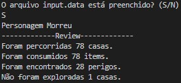

# Labirinth-Game
O objetivo do desafio é fazer um labirinto com diversas matrizes, em que um personagem percorre o labirinto.
As condições de parada do labirinto são:
- A vida do personagem acabar (começa com 10);
- Percorrer um caminho no labirinto que percorra todas as matrizes dadas, comece da posição inicial, termine na posição inicial e encontre apenas 0.  
O labirinto pe composto de:
- Números, representando a quantidade de items que uma casa possui (a cada 4 items o personagem ganha um de vida caso esteja abaixo de 10);
- \# representando paredes, aonde o personagem não pode caminhar;
- \* representando perigos, aonde o personagem perde uma vida.
# Logica
No começo do programa o código pergunta se o arquivo está pronto, caso sim, ele lê as matrizes do arquivo "input.data" presente na pasta dataset, caso não ele pergunta o tamanho das matrizes, a quantidade de matrizes, e o número máximo de items em uma casa, e com isso gera o arquivo "input.data" (*Matriz::GeraMatriz()*). A codificação do arquivo deve ser a seguinte:
> tam_matriz tam_matriz qtd_matrizes  
> num num num  
> num num num  
> num num num  
>  
> num num num  
> num num num  
> num num num  

Após ler as matrizes o código salva cada matriz em um arquivo próprio (*Matriz::PreencheArquivos()*), para evitar "stack overflow" e cria uma estrutura Labirinro que possui os atributos: 
- **int matrizAtual** / Diz qual matriz o código está;
- **int contCasas** / Diz quantas casas com número foram percorridas;
- **int contPerigos** / Diz quantas casas com \* foram percorridas;
- **bool caminhoEZero** / Utilizada para atender a segunda condição de parada;
- **bool passouNasMatrizes** / Utilizada para atender a segunda condição de parada;
- **pair<int,int> posicaoInicial** / Seta a posição inicial assim que o código é criado;
- **pair<int,int> \*\*matriz** / Abriga a matriz que está sendo percorrida no momento;
- **Personagem Couto** / Variável que diz quantos items o personagem pegou e quanto de vida ele possui;

Depois da classe labirinto ser inicializada, o código começa a percorrer (*Labirinto::StartQuest()*) as matrizes, começando da posição inicial e indo para direções randomicas utilizando a função *rand()%8*.

As direções são dadas de 0-7 sendo: 0-direita, 1-direita_inferior, 2-baixo, 3-esquerda_inferior, 4-esquerda, 5-esquerda_superior, 6-cima, 7-direita_superior (*Labirinto::AndaMatriz()*).

Se o personagem caminha até a borda da matriz caso ele ande para fora dela, ele aciona um teletransporte para a matriz seguinte (*labirinto.cpp (22)*), a não ser que ele esteja na última matriz, sendo assim o teleporte será direcionado à primeira matriz.

A cada teleporte a matriz que foi percorrida é salva no seu arquivo original (*Labirinto::AtualizaMatriz()*), e a nova matriz a percorrer é carregada (*Labirinto::PreencheMatriz()*). Vale lembrar que esses arquivos também guardam as posições que foram percorridas.

Quando o personagem cai numa nova matriz, o programa garante que ele não caia em uma parede. O código garante também que uma casa não entre em looping, já que se o labirinto não possuir acesso às bordas o código entrará em looping infinito, essa garantia é feita com o segundo item da variável **pair<int,int> matriz**, que conta quantas vezes a casa foi visitada naquela abertura da matriz. Caso o número exceda 50, o teleporte é acionado.

Caso o personagem morra no meio do caminho, ou caso no início do while de percorrer, as váriáveis caminhoEZero, passouNasMatrizes sejam verdadeiras, a matrizAtual seja 1, e posiçãoInicial seja igual à posiçãoAtual.

Por fim, é feita a exibição de dados utéis da execução, como casas percorridas, items consumidos, perigos encontrados e casas não exploradas. Assim como é feito um arquivo "percorridas.data" presente na pasta dataset que possui a relação de paredes (=), casas percorridas (1) e casas não percorridas (0).

Obs.:    
- O arquivo deve ser dado na mesma maneira que o apresentado.
- O arquivo não deve possuir números negativos.
- As matrizes devem ser quadradas.

# Exemplo de execução
Arquivo:

> 4 4 3   
> \# \# 68 90    
> \* 80 69 \#    
> \* 131 \# 41    
> \* \* 123 \*    
>    
> 76 \# \* \*    
> \# \# 69 99   
> \* 36 82 \#   
> 82 51 \# 65   
>   
> 121 \* 2 77   
> 8 \# \# 16   
> \* \# 125 34   
> \# \# \* 52   

Execução:

	 

Arquivo das posições que passou:
> = = 1 1   
> 0 1 1 1   
> 1 = 1 1   
> 1 = 1 1   
>  
> 1 1 1 1   
> 1 1 1 1   
> 1 1 1 1   
> 1 1 1 1   
>  
> 1 1 1 1   
> 1 1 1 1   
> 1 1 1 =   
> 1 1 1 1 

# Compilação e Execução

O programa possui um arquivo Makefile que realiza todo o procedimento de compilação e execução. Para tanto, temos as seguintes diretrizes de execução:

| Comando                |  Função                                                                                           |                     
| -----------------------| ------------------------------------------------------------------------------------------------- |
|  `make clean`          | Apaga a última compilação realizada contida na pasta build                                        |
|  `make`                | Executa a compilação do programa utilizando o gcc, e o resultado vai para a pasta build           |
|  `make run`            | Executa o programa da pasta build após a realização da compilação                                 |
